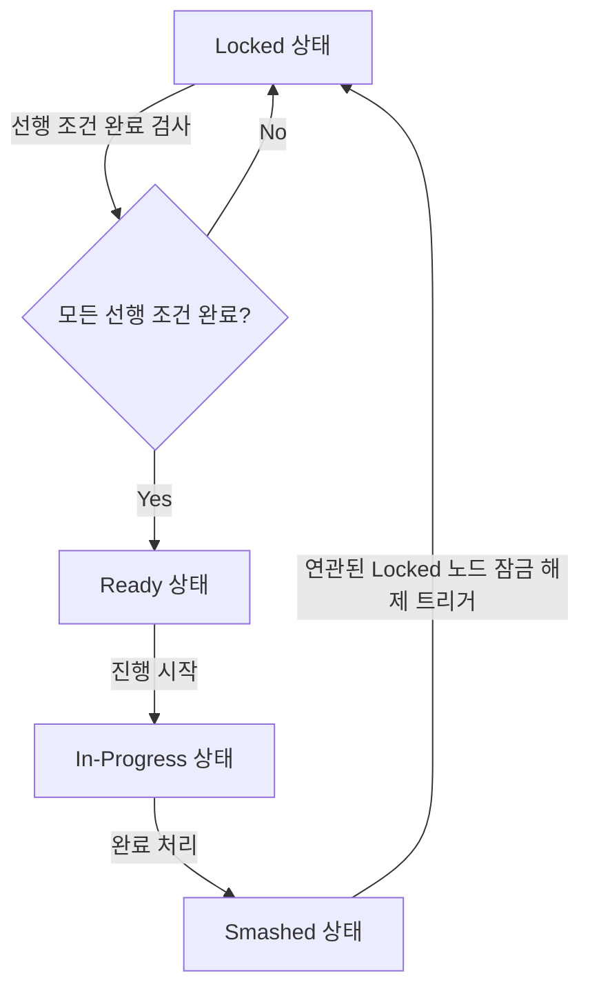

# Funny Todo 시스템 아키텍처 및 분석 보고서

## 1. 프로젝트 개요
Funny Todo는 단순한 할 일 관리를 넘어 개발자의 아이디어를 구조화하고 블로그 주제를 노드 기반으로 확장 및 관리하는 혁신적인 생산성 애플리케이션입니다. 아이디어 간의 선행 조건 관계를 매핑하고, 특정 단계가 완료되면 하위 단계가 자동으로 활성화되는 지식 확장 모델을 가지고 있습니다.

## 2. 기술 스택
| 영역 | 상세 기술 |
|---|---|
| 프론트엔드 | Next.js 16.2.4 (App Router), React 19.2.4 |
| 스타일링 | Vanilla CSS (프리미엄 글래스모피즘 및 연한 블루 테마 기반) |
| 상태관리 | React Hooks (useState, useEffect, useMemo, useCallback, IdeasProvider) |
| 그래프 시각화 | React Flow 11.11.4 |
| 애니메이션 | Framer Motion 12.38.0 |
| 백엔드 / DB | Supabase (PostgreSQL, Auth, Realtime 예정) |

## 3. 핵심 비즈니스 로직 (Idea Release Logic)
아이디어는 네 가지 상태를 가집니다.
- locked: 선행 조건이 완료되지 않아 비활성화된 상태
- ready: 선행 조건이 완료되어 즉시 실행할 수 있는 상태
- in-progress: 현재 수행 중인 상태
- smashed: 수행이 완료된 상태

### 아이디어 해제 조건 캐스케이드 규칙
1. 사용자가 특정 아이디어를 완료(smashed) 처리합니다.
2. 시스템은 해당 아이디어를 완료한 로컬 상태를 갱신합니다.
3. locked 상태인 다른 모든 아이디어를 조회하여, 그 아이디어들의 prerequisites(선행 조건 ID 리스트)를 검사합니다.
4. 선행 조건으로 지정된 모든 아이디어가 smashed 상태로 판명되면, 해당 locked 아이디어를 ready 상태로 자동 전환합니다.

## 4. 디렉토리 구조 및 핵심 파일 역할
- **src/app/**: App Router 기반 페이지 라우팅
  - **page.tsx**: 대시보드 화면. 활성화된 체인 진행률 및 아이디어 파이프라인 그리드 뷰를 렌더링합니다.
  - **nodes/page.tsx**: React Flow를 사용한 블로그 노드 캔버스 화면. 주제 간 연관 관계를 시각적으로 연결합니다.
  - **globals.css**: 글래스모피즘 테마를 구현하기 위한 반투명 백드롭 필터, 연한 블루 테마 색상 및 공통 스타일 선언.
- **src/components/**: 재사용 가능한 컴포넌트
  - **IdeaCard.tsx**: 개별 아이디어의 제목, 본문, 상태 배지, 활성화 여부에 따른 액션 버튼을 렌더링하고 애니메이션 처리합니다.
  - **Navigation.tsx**: 데스크톱 사이드바 및 모바일 바텀 탭 내비게이션을 렌더링합니다. (노드 캔버스 화면에서는 숨김 처리)
  - **ui/index.tsx**: 공통 UI 컴포넌트인 NeoButton과 StatusBadge가 포함되어 있습니다.
- **src/hooks/**: 커스텀 훅
  - **useIdeas.ts**: 아이디어 리스트 상태 관리 및 smashIdea 액션 수행(캐스케이드 해제 기능 포함). 현재는 Supabase 연동 전으로 setTimeout과 mockData를 사용 중입니다.
- **src/data/**: 모크 데이터
  - **mockData.ts**: 초기 개발을 위한 임시 아이디어 레코드 목록.

## 5. 현재 개발 단계 및 제언
- **현재 상황**: 기본적인 글래스모피즘 및 연한 블루 디자인 토큰 수립 및 대시보드/노드 캔버스 UI의 정적 뼈대 구현이 완료되었습니다. 비즈니스 로직은 로컬 모크 데이터 기반으로 동작하고 있습니다.
- **다음 과제**:
  - Supabase 연동을 위한 데이터베이스 테이블 마이그레이션 적용 및 스키마 반영.
  - useIdeas.ts 내의 Supabase 연동 주석 해제 및 DB 쿼리 구현.
  - 노드 캔버스에서 노드 추가, 저장 기능 등의 서버 연동.
