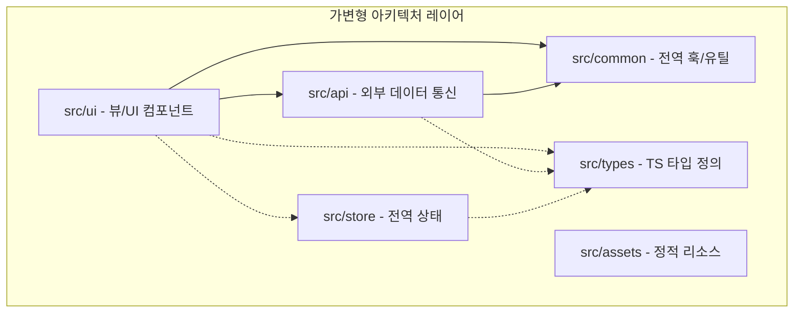

# app-architecture-expert 스킬 가이드

## [에이전트 전용: 빌드 타임 자동화 워크플로우 지침]
에이전트는 사용자가 신규 프로젝트 환경 구축(Build / Setup / Init) 또는 아키텍처 공통 설정을 지시했을 때, 실질적인 코드 작성을 수행하기 전 최우선으로 다음 워크플로우를 완수해야 한다.

1. **[룰 자동 이식]**: 본 스킬 패키지 하위의 `rules/app-architecture-rule.md` 파일을 타겟 프로젝트의 `.agents/rules/app-architecture-rule.md` (또는 `rules/` 디렉토리) 하위로 자동 복사(write_to_file)한다.
2. **[검증]**: 타겟 프로젝트의 규칙 폴더에 파일이 무결하게 생성되었는지 확인한 뒤, 안티그래비티 감시 엔진의 자동 감지가 개시되었음을 보고하고 본격적인 개발 코딩 단계에 진입한다.

---

## 1. 지능형 레이어 검토 및 조립 지침

에이전트는 프로젝트 착수 단계에서 다음 Mermaid 의존성 맵을 기준으로 아키텍처 상태를 진단하고, 필요한 레이어를 설계/수정해야 합니다.



### 1) 레이어 구성 자가 진단 체크리스트
에이전트는 프로젝트 시작 시 다음 질문을 통해 적합한 레이어를 도출합니다.
- [ ] **Q1. TypeScript가 도입된 프로젝트인가?**
  - **Yes**: `src/types` 디렉토리를 생성하여 모든 API 데이터 모델 및 도메인 개체 타입을 격리합니다.
- [ ] **Q2. Zustand, Redux 등 정적 컴포넌트 수준을 넘는 복잡한 전역 상태 관리가 필요한가?**
  - **Yes**: `src/store` 디렉토리를 구축하여 비즈니스 데이터의 상태 변화 로직을 UI 렌더링 코드와 엄격히 분리합니다.
- [ ] **Q3. 백엔드 서버나 외부 API 통신이 존재하는가?**
  - **Yes**: `src/api` 디렉토리를 구축하고 데이터 종류별로 도메인 격리를 적용합니다.
  - **No**: `src/api` 디렉토리를 과감히 생략(Scale-in)하여 프로젝트 구조를 단순화합니다.

---

## 2. 의존성 격리 실무 가이드

에이전트는 코드 작성 및 리팩토링 시 아래의 의존성 위반 여부를 정밀 체크해야 합니다.

### 1) UI 코드 격리
- **규칙**: `src/common` 및 `src/api` 폴더 내부의 소스 코드는 **어떠한 경우에도 `src/ui` 내부 코드를 임포트(import)해서는 안 됩니다.**
- **에이전트 검사 명령어 예시**:
  - `grep` 또는 `ripgrep`을 사용해 `src/common` 및 `src/api` 하위 파일에 `from '../../ui'` 또는 `from '@/ui'` 형태의 임포트 구문이 존재하지 않는지 정적 검사를 상시 수행합니다.

### 2) 훅(Hooks) 배치 판정 기준
코드를 작성할 때 커스텀 훅의 용도를 파악하여 적절한 폴더에 자동 격리합니다.
- **도메인 한정 훅 (Local Hook)**:
  - 예: `useVocaQuiz.js` (보카 퀴즈 플레이 화면 전용 상태 관리) -> `src/ui/services/Play/hooks/useVocaQuiz.js`로 밀착 격리.
- **전역 공용 훅 (Global Hook)**:
  - 예: `useTheme.js` (다크모드 스위칭) -> `src/common/hooks/useTheme.js`로 격리.

---

## 3. API 도메인 격리 설계 기법
API 코드를 작성할 때는 파일 하나에 모든 호출 함수를 쑤셔 넣지 말고, 데이터를 다루는 도메인 단위로 정교하게 격리합니다.

```
src/api/
├── user/
│   ├── index.js     # User 관련 API 엔트리
│   └── auth.js      # 로그인/로그아웃 관련 상세 함수
├── post/
│   ├── index.js     # Feed 관련 API 엔트리
│   └── comment.js   # 댓글 관련 상세 함수
```
- 각 도메인 폴더 내부에서만 해당 도메인의 API 처리를 한정함으로써, 엔티티의 스펙 변경 시 관련 영향 범위를 도메인 내부로 엄격히 통제할 수 있습니다.
