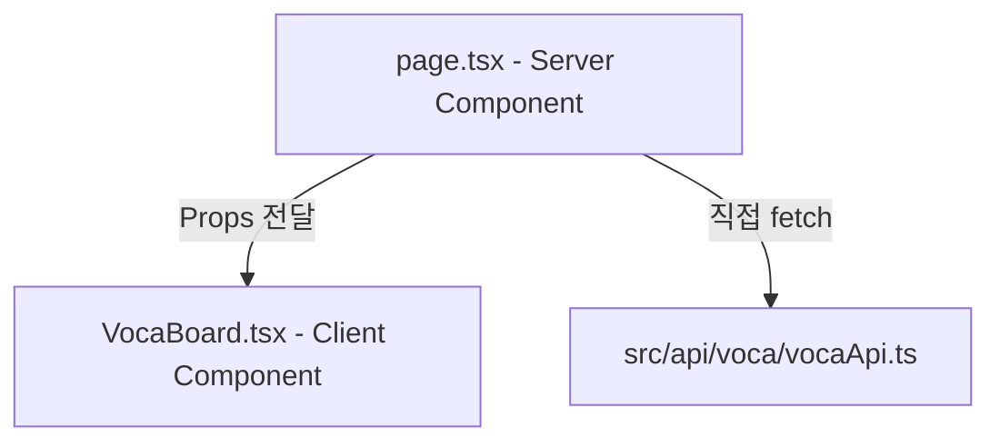

# next-expert 스킬 가이드

## [에이전트 전용: 빌드 타임 자동화 워크플로우 지침]
에이전트는 사용자가 신규 Next.js 프로젝트 환경 구축(Build / Setup / Init) 또는 아키텍처 공통 설정을 지시했을 때, 실질적인 코드 작성을 수행하기 전 최우선으로 다음 워크플로우를 완수해야 한다.

1. **[룰 자동 이식]**: 본 스킬 패키지 하위의 `rules/next-expert-rule.md` 파일을 타겟 프로젝트의 `.agents/rules/next-expert-rule.md` (또는 `rules/` 디렉토리) 하위로 자동 복사(write_to_file)한다.
2. **[검증]**: 타겟 프로젝트의 규칙 폴더에 파일이 무결하게 생성되었는지 확인한 뒤, 안티그래비티 감시 엔진의 자동 감지가 개시되었음을 보고하고 본격적인 개발 코딩 단계에 진입한다.

---

본 스킬은 Next.js App Router 생태계 및 서버 사이드 렌더링(SSR) 환경에 최적화되어, **Server Component와 Client Component의 경계를 완벽하게 구분**하여 성능을 쥐어짜고, **`src/app/` 내부 Server Component 중심의 데이터 페칭 흐름**을 구축하는 기술 가이드를 제시합니다.

---

## 1. Server/Client Component 경계 설계 템플릿

Next.js App Router의 성능 극대화를 위해, 에이전트는 하나의 화면을 통째로 `"use client"`로 두지 않고, 상태 관리와 이벤트 헨들러가 요구되는 **단위 UI 노드만 정밀하게 Client Component로 격리 추출**합니다.



### 1) 컴포넌트 쪼개기 실무 예시

#### ① [page.tsx] - 라우팅 엔트리 및 데이터 페칭 (Server Component)
```typescript
/**
 * src/app/voca/page.tsx
 * 서버 사이드 렌더링(SSR) 및 데이터 수집을 전담하는 순수 Server Component
 */
import { getVocaList } from '@/api/voca/vocaApi';
import VocaBoard from './components/VocaBoard';

export const revalidate = 3600; // 1시간 단위 정적 재생성 ISR 선언

export default async function VocaPage() {
  // 1. 서버 측에서 백엔드 데이터를 직접 비동기적으로 가져옴
  const vocaList = await getVocaList();

  return (
    <main style={{ padding: '24px' }}>
      <h1>서버 렌더링 단어장</h1>
      {/* 2. 직렬화된 데이터를 클라이언트 인터랙션 컴포넌트에 Props로 즉시 주입 */}
      <VocaBoard initialList={vocaList} />
    </main>
  );
}
```

#### ② [VocaBoard.tsx] - 클라이언트 인터랙션 컴포넌트 (Client Component)
```typescript
/**
 * src/app/voca/components/VocaBoard.tsx
 * 상태 제어 및 검색/필터링 등 사용자 인터랙션을 전담하는 Client Component
 */
'use client';

import React, { useState } from 'react';

interface VocaItem {
  id: string;
  word: string;
  meaning: string;
}

interface VocaBoardProps {
  initialList: VocaItem[];
}

const VocaBoard: React.FC<VocaBoardProps> = ({ initialList }) => {
  const [searchTerm, setSearchTerm] = useState('');
  const [list, setList] = useState<VocaItem[]>(initialList);

  const handleSearch = (e: React.ChangeEvent<HTMLInputElement>) => {
    const term = e.target.value;
    setSearchTerm(term);
    
    // 로컬 상태 즉각 필터링 (동기식 무지연 UI 반영)
    if (term.trim() === '') {
      setList(initialList);
    } else {
      setList(
        initialList.filter((item) =>
          item.word.toLowerCase().includes(term.toLowerCase())
        )
      );
    }
  };

  return (
    <div style={{ marginTop: '16px' }}>
      <input
        type="text"
        placeholder="단어 검색..."
        value={searchTerm}
        onChange={handleSearch}
        style={{ padding: '8px', width: '100%', maxWidth: '300px', marginBottom: '16px' }}
      />
      
      <div style={{ border: '1px solid #ddd', padding: '16px', borderRadius: '8px' }}>
        {list.length === 0 ? (
          <p>검색 결과가 존재하지 않습니다.</p>
        ) : (
          <ul>
            {list.map((item) => (
              <li key={item.id} style={{ marginBottom: '8px' }}>
                <strong>{item.word}</strong>: {item.meaning}
              </li>
            ))}
          </ul>
        )}
      </div>
    </div>
  );
};

export default VocaBoard;
```

---

## 2. Next.js 특화 데이터 페칭 최적화 가이드

에이전트는 Next.js 개발 시 다음 규칙을 항상 적용하여 서버 및 렌더링 성능을 보장합니다.

- **데이터 캐싱 활용 (Data Caching)**:
  - Next.js의 확장된 `fetch` API를 사용하여 백그라운드 캐시 및 재검증 전략을 명시적으로 제어합니다.
  - 예시: `fetch('api-url', { next: { revalidate: 60 } })`
- **의존성 래퍼 격리**:
  - `src/api`에 작성되는 Next.js 데이터 패칭 함수 역시 프레임워크 뷰 코드(`src/app/`의 UI)에 종속되지 않는 독립 인터페이스로 작성되어야 합니다.
